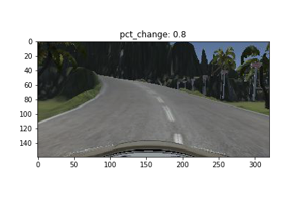

#**Behavioral Cloning** 

---

**Behavioral Cloning Project**

The goals / steps of this project are the following:
* Use the simulator to collect data of good driving behavior
* Build, a convolution neural network in Keras that predicts steering angles from images
* Train and validate the model with a training and validation set
* Test that the model successfully drives around track one without leaving the road
* Summarize the results with a written report


[//]: # (Image References)

[image1]: ./examples/placeholder.png "Model Visualization"
[image2]: ./examples/placeholder.png "Grayscaling"
[image3]: ./examples/placeholder_small.png "Recovery Image"
[image4]: ./examples/placeholder_small.png "Recovery Image"
[image5]: ./examples/placeholder_small.png "Recovery Image"
[image6]: ./examples/placeholder_small.png "Normal Image"
[image7]: ./examples/placeholder_small.png "Flipped Image"

## Rubric Points
###Here I will consider the [rubric points](https://review.udacity.com/#!/rubrics/432/view) individually and describe how I addressed each point in my implementation.  

---
###Files Submitted & Code Quality

####1. Submission includes all required files and can be used to run the simulator in autonomous mode

My project includes the following files:
* model.py containing the script to create and train the model
* drive.py for driving the car in autonomous mode
* model.h5 containing a trained convolution neural network 
* writeup_report.md summarizing the results

####2. Submission includes functional code
Using the Udacity provided simulator and my drive.py file, the car can be driven autonomously around the track by executing 
```sh
python drive.py model.h5
```

####3. Submission code is usable and readable

The model.py file contains the code for training and saving the convolution neural network. The file shows the pipeline I used for training and validating the model, and it contains comments to explain how the code works.

###Model Architecture and Training Strategy

####1. An appropriate model architecture has been employed

My model consists of three covnets with with 5x5 filter sizes and depths between 24 and 48, two covnets with 3x3 filter sizes and depths of 64. Lasty, there are three fully connected layers with depths of 100, 50, and 10 (model.py lines 74-86).

The model includes RELU activate functions to introduce nonlinearity (code lines 77-81), and the data is normalized in the model using a Keras lambda layer (code line 75). 

####2. Attempts to reduce overfitting in the model 

Roughly half of the training data was captured by driving around the tracks in the opposite direction. All images were augmented by applying a random degree brightness change. All images were duplicated and flipped to avoid the model overfitting to one steering direction. The model was trained and validated on different data sets. The model was also tested by running it through the simulator and ensuring that the vehicle could stay on the track.

####3. Model parameter tuning

This model used an adam optimizer, so the learning rate was not tuned manually (model.py line ).

####4. Appropriate training data

Training data was chosen to keep the vehicle driving on the road. I used a combination of center lane driving and recovery maneuvers from both the left and the right sides of the road.

For details about how I created the training data, see the next section. 

###Model Architecture and Training Strategy

####1. Solution Design Approach

The strategy for deriving a model architecture was to find a model that has proven success, rather than to reinvent the wheel. Many Udacity students have reported success with [Nvidia's CNN designed for self-driving cars](https://arxiv.org/pdf/1604.07316v1.pdf).

The model immediately performed well, but was showin signs of overfitting. I experimented with adding dropout to a variety of combination of layers, with little improvement. The car would zig-zag on parts of the track, drive very smoothly on other parts, and drive straight off the track on otherts. This indicated that the model was still overfitting to parts of the data and not generalizing.

To combat the overfitting, I drove both tracks in both directions. This included center driving and recovery maneuvers. When the car showed signs of trouble in certain parts of the track, I would go back and drive that part of the track with center driver and recovery maneuvers, in both direcetions. However, as soon as the car improved driving on one part of the track, it would performed worse on other parts. This told me that the model was still not generalizing enough.

The final step was to apply random brightness levels to all of the images. This provided enough variance in the data to enable the model to generalize, rather than to memorize. I saw an immediate and drastic improvement in the car's ability to navigate the track. It performed well in all areas of the track and recoverered well. It was immediately obvious that the model had learned and was generalizing well.

At the end of the process, the vehicle is able to drive autonomously around the track without leaving the road.

####2. Final Model Architecture

The final model architecture consisted of a convolution neural network with the following layers and layer sizes:

* Input (160x320x3)
* Lambda layer (normalize image data to betweeen -0.5 and 0.5)
* Cropping2D (new image shape is 65x260x3)
* Conv Layer (5x5x3 filter, stride 2 to 31x128x24)
* Relu
* Conv Layer (5x5x24 filter, stride 2 to 14x62x36)
* Relu
* Conv Layer (5x5x36 filter, stride 2 to 5x29x48)
* Relu
* Conv Layer (3x3x48 filter, stide 1 to 3x27x64)
* Relu
* Conv Layer (3x3x64 filter, stide 1 to 1x25x64)
* Relu
* Flatten (1536 nodes)
* Fully connected layer (with added dropout) (1600->100)
* Fully connected layer (with added dropout) (100->50)
* Fully connected layer (with added dropout) (50->10)
* Output (10->1)


####3. Creation of the Training Set & Training Process

I recorded several laps driving in the center of the road to teach the vehicle good driving behavior. I did this on both tracks, driving in both directions. Here is an example image of center lane driving:


I then recorded the vehicle recovering from the left side and right sides of the road back to center so that the vehicle would learn to recover from off-center positions. These images show what a recovery looks like starting from the left side :


To augment the dataset, I flipped images and angles thinking that this would normalize the distrubtion of string angles. For example, here is an image that has then been flipped:


Here is the distribution of steering angles after adding offset angles for left and right cameras and adding flipped images/angles:


Here are examples of the range of the random brightness adjustments applied to images:





After collecting and augmenting the data, I had a total of 906,800 images. I then preprocessed the data using a keras lambda layer to normalize the image data and a cropping layer to crop 70 pixels from the top of the image, 25 pixels from the bottom, and 30 pixels from each side. Here are examples of the final images fed into the neural network:


I finally randomly shuffled the data set and put Y% of the data into a validation set. 

I used this training data for training the model. The validation set helped determine if the model was over or under fitting. The ideal number of epochs was Z as evidenced by ... I used an adam optimizer so that manually training the learning rate wasn't necessary.
